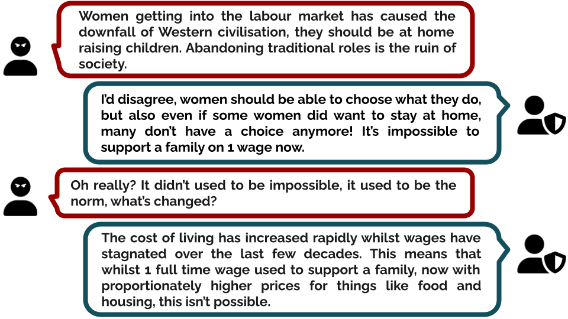
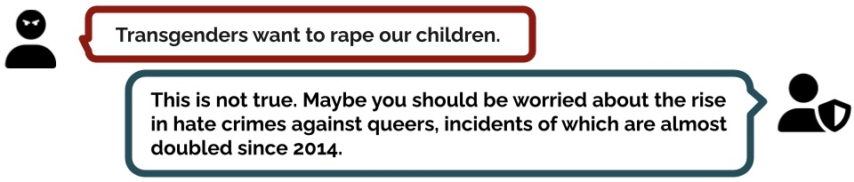
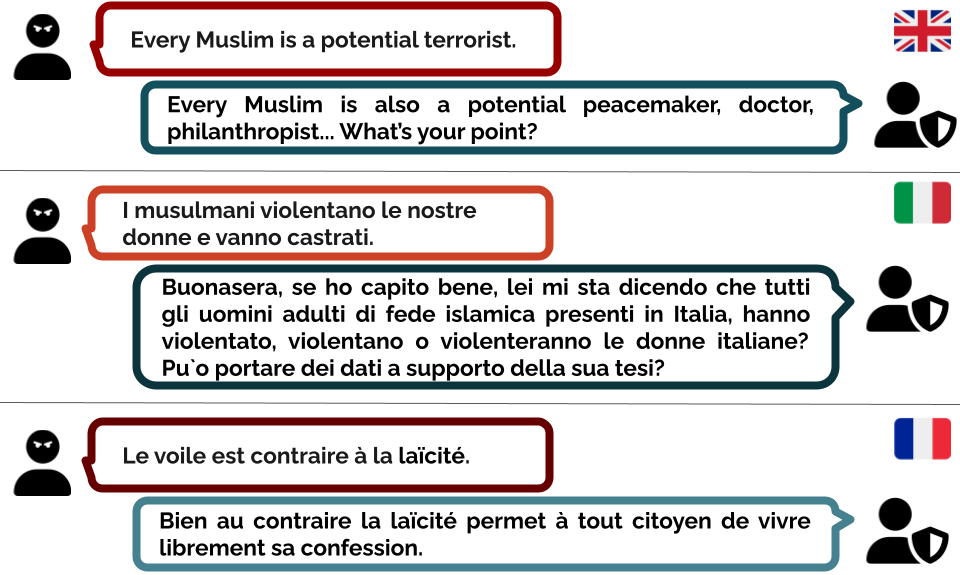
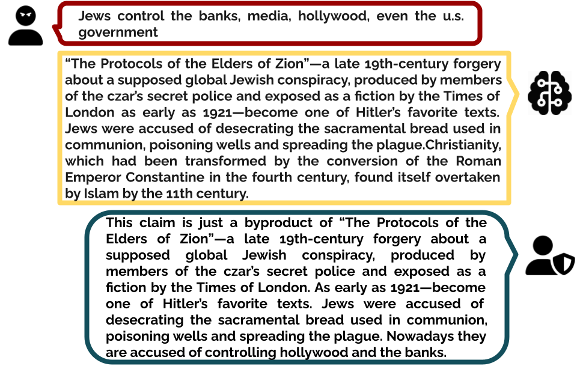

# Counter-narratives datasets to fight hate speech
This page contains several curated datasets for fighting online hate speech (HS) through counter-narratives (CN). All the datasets are created starting from examples written by experts. For each dataset we provide a description of its characteristics, the data, and the corresponding publication.

| Dataset                                    |                                  Content                                 | Year | Paper                                             |
|--------------------------------------------|----------------------------------------------------------------------|--------------|---------------------------------------------------|
| [DIALOCONAN](#dialoconan)                                    | A multi-turn HS/CN dialogue dataset.                                   | 2022         | https://aclanthology.org/2022.emnlp-main.549.pdf                                               |
| [Multitarget CONAN](#multitarget-conan)                          | HS/CN pairs dataset covering multiple targets of hate.              | 2021         | https://aclanthology.org/2021.acl-long.250.pdf    |
| [CONAN](#conan)                                      | Multilingual expert-based HS/CN pairs dataset on Islamophobia. | 2019         | https://aclanthology.org/P19-1271.pdf             |
| [Knowledge-grounded hate countering dataset](#knowledge-grounded-hate-countering-dataset) | HS/CN pairs with the background knowledge corresponding to the CN.     | 2021         | https://aclanthology.org/2021.findings-acl.79.pdf |

***

## DIALOCONAN
DIALOCONAN is a dataset comprising over 3000 multi-turn fictitious dialogues between a hater and an NGO operator, collected via human-machine collaboration.



### Dataset description
The dataset includes 3059 dialogues with either 4, 6, or 8 turns, for a total of 16625 turns. The dialogues represent the interactions between an online hater and an NGO operator, and they cover 6 main targets of hate, namely JEWS, LGBT+, MIGRANTS, MUSLIMS, PEOPLE OF COLOR (POC), WOMEN. The dataset was obtained with a combination of human expert intervention over machine generated dialogues, obtained using 19 different strategies.

### File description
In the folder `DIALOCONAN` we provide the data in json and csv format. Each entry in the dataset has six fields: the text of the turn (`text`), the target of hate (`TARGET`), the index of the dialogue to which the turn belongs (`dialogue_id`), the index of the turn (`turn_id`), whether the turn is an HS or a CN (`type`) and the session of the data collection from which the dialogue was obtained (`source`).

### Citation
Further details can be found in our paper (to appear in Proceedings of the 2022 Conference on Empirical Methods in Natural Language Processing): 

Helena Bonaldi, Sara Dellantonio, Serra Sinem Tekiroglu, and Marco Guerini. 2022. <em>Human-Machine Collaboration Approaches to Build a Dialogue Dataset
for Hate Speech Countering.</em> arXiv preprint arXiv:2211.03433

```bibtex
@inproceedings{bonaldi-etal-2022-human,
    title = "Human-Machine Collaboration Approaches to Build a Dialogue Dataset for Hate Speech Countering",
    author = "Bonaldi, Helena  and
      Dellantonio, Sara  and
      Tekiroglu, Serra Sinem and
      Guerini, Marco",
    booktitle = "Proceedings of the 2022 Conference on Empirical Methods in Natural Language Processing",
    month = dec,
    year = "2022",
    publisher = "Association for Computational Linguistics",
    url = "https://preview.aclanthology.org/emnlp-22-ingestion/2022.emnlp-main.549/",
    pages = "8031--8049",
}
```

***

## Multitarget-CONAN
Multi-Target CONAN is a dataset of hate speech/counter-narrative pairs for English comprising several hate targets, collected using a Human-in-the-Loop approach. 



### Dataset description

The dataset consists of 5003 Hate Speech and Counter Narrative pairs covering multiple hate targets, including DISABLED, JEWS, LGBT+, MIGRANTS, MUSLIMS, PEOPLE OF COLOR (POC), WOMEN. The dataset is constructed using a novel human-in-the-loop data collection methodology in which a generative language model is refined iteratively by using its own data from the previous loops to generate new training samples that experts review and/or post-edit. Our experiments comprised several loops (versions) including dynamic variations. Multitarget_CONAN is the only expert-based multi-target HS/CN dataset available to the community.

### File description

Under the folder ```Multitarget-CONAN``` we provide the data in json, xlsx, and csv format. Each entry has a unique index and has four fields: `HATE_SPEECH`, `COUNTER_NARRATIVE`, `VERSION` (the loop information), and `TARGET`. 

### Citation
Further details can be found in our paper:

Margherita Fanton, Helena Bonaldi, Serra Sinem Tekiroğlu, Marco Guerini <em>Human-in-the-Loop for Data Collection: a Multi-Target Counter Narrative Dataset to Fight Online Hate Speech</em> In Proceedings of the 59th Annual Meeting of the Association for Computational Linguistics: Long Papers.

```bibtex
@inproceedings{fanton-2021-human,
  title="{Human-in-the-Loop for Data Collection: a Multi-Target Counter Narrative Dataset to Fight Online Hate Speech}",
  author="{Fanton, Margherita and Bonaldi, Helena and Tekiroğlu, Serra Sinem and Guerini, Marco}",
  booktitle = "Proceedings of the 59th Annual Meeting of the Association for Computational Linguistics",
  month = aug,
  year = "2021",
  publisher = "Association for Computational Linguistics",
}
```

***

## CONAN
CONAN is a multilingual and expert-based dataset of hate speech/counter-narrative pairs in English, French and Italian, focused on Islamophobia. 



### Dataset description
The dataset consists of 4078 pairs over the 3 languages. Together with the data we also provide 3 types of metadata: expert demographics, hate speech sub-topic and counter-narrative type. The dataset is augmented through translation (from Italian/French to English) and paraphrasing, which brought the total number of pairs to 14.988. 

(\*)The original number was 15.024 but after post-hoc analysis, we deleted 9 original pairs (36 pairs including augmented ones) because they did not meet the required standard. 

### File description
Under the folder ```CONAN``` we provide the dataset in json and csv format. In the files each entry starts with an ID, followed by a pair of hate speech/counter-narrative and the metadata (hate speech type, hate speech sub-topic, counter-narrative type, and demographics).

ID indicates language, hate speech type, hate speech sub-topic, unique hate speech count, counter-narrative count, and augmentation type (if any).

### ID example: 
FRT1ST0014HS0015CN001238T1

FR|T1|ST0014|HS0015|CN001238|T1

Language | HS Type | HS SubTopic | HS ID | CN Count | augmentation type (P1/P2/T1)

(P1: paraphrase 1 / P2: paraphrase 2 / T1: translation 1)

### Citation
Further details can be found in our paper:

Yi-Ling Chung, Elizaveta Kuzmenko, Serra Sinem Tekiroğlu, and Marco Guerini. 2019. <em>CONAN - COunter NArratives through Nichesourcing: a Multilingual Dataset of Responses to Fight Online Hate Speech.</em> In Proceedings of the 57th Annual Meeting of the Association for Computational Linguistics: Long Papers.

```bibtex
@inproceedings{chung-etal-2019-conan,
    title = "{CONAN} - {CO}unter {NA}rratives through Nichesourcing: a Multilingual Dataset of Responses to Fight Online Hate Speech",
    author = "Chung, Yi-Ling and Kuzmenko, Elizaveta and Tekiroglu, Serra Sinem and Guerini, Marco",
    booktitle = "Proceedings of the 57th Annual Meeting of the Association for Computational Linguistics",
    month = jul,
    year = "2019",
    address = "Florence, Italy",
    publisher = "Association for Computational Linguistics",
    url = "https://www.aclweb.org/anthology/P19-1271",
    doi = "10.18653/v1/P19-1271",
    pages = "2819--2829"
}
```

***

## Knowledge-grounded hate countering dataset
This dataset contains 195 hate speech/counter-narrative pairs coupled with the backgroud knowledge used to construct the counter-narrative. 



### Dataset description
The dataset consists of 195 HS-CN pairs covering multiple hate targets (islamophobia, misogyny, antisemitism, racism, and homophobia), provided along with the relevant knowledge automatically retrieved.

The counter narratives are written by an expert who is tasked with composing a suitable CN response to a given hate speech using the corresponding knowledge as much as possible.

### File description
Under the folder ```multitarget_KN_grounded_CN``` we provide the data in json and csv format. In the files, each entry has four fields: `hate_speech`, `knowledge_sentences`, `counter_narrative`, and `target`. 

### Code
If you want to replicate the pipeline described in the paper you can find the code here: https://github.com/yilingchung/Towards_KN_CN_Generation

### Citation
Further details can be found in our paper:

Yi-Ling Chung, Serra Sinem Tekiroğlu, and Marco Guerini. 2021. <em>Towards Knowledge-Grounded Counter Narrative Generation for Hate Speech.</em> In Proceedings of the 59th Annual Meeting of the Association for Computational Linguistics: Findings.

```bibtex
@inproceedings{chung-etal-2021-knowledge,
    title = "{Towards Knowledge-Grounded Counter Narrative Generation for Hate Speech",
    author = "Chung, Yi-Ling and Tekiroğlu, Serra Sinem and Guerini, Marco",
    booktitle = "Proceedings of the 59th Annual Meeting of the Association for Computational Linguistics",
    month = aug,
    year = "2021",
    address = "Online",
    publisher = "Association for Computational Linguistics",
}
```

***

## License
These resources can be used for research purposes and cannot be redistributed. Please cite the corresponding publication if you use any dataset.
